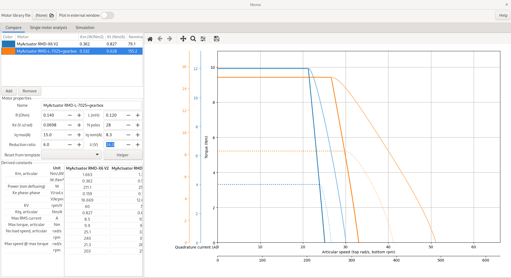

# Nemo

In drones or in robotics, brushless motors are becoming more and more common. However, choosing the right motor for the right application can be quite difficult. Indeed, understanding datasheets can be quite complexe: is a motor with a no-load speed of 5000rpm more powerful that one with the same torque, but specified for 3000rpm at max torque? How do you compare a motor with a KV of 500 rpm/V with one with a Kt of 0.5Nm/Arms? And what do these value even mean? Sometimes you might feel like nobody can answer - well now, **Nemo** can!

**Nemo** is a *Nifty Evaluator for MOtors* - more practically, it is a tool to compare brushless motors (PMSM). While the choice of the "best" motor ultimately depends on the application, **Nemo** will help you in making a fair comparison between motors from various manufacturers, to truly understand their limit.

Let's take an example: [My Actuator](https://www.myactuator.com/)'s pancake motors. How does the old [RMD-L-7025](https://www.myactuator.com/product-page/rmd-l-7025), equipped with a 1:6 gearbox, compare to the newer [RMD-X6 1:6](https://www.myactuator.com/product-page/rmd-x6). Well, here are the motor's characteristics (torque-speed curve) and specs for a direct comparison:


**Nemo** can be used to:

  - compare motors from different manufacturers and choose the best for a given application
  - obtain detailed information about a motor, like output power, efficiency, required battery current... that may not be available on the datasheet
  - more generally, learn about brushless motors, as the [full mathematical model is detailed here](src/nemo_bldc/doc/BrushlessMotorPhysics.pdf)

Please see the [User Manual](doc/user_manual.pdf) for more information on the software.

<u>*Important note*</u>: **Nemo** works by using the classical linear model of non-sallient PMSM. While this model is known to be fairly accurate (being the base of Field-Oriented Control), in practice non-linear phenomenons can alter motor performance (magnetic saturation, cogging, friction...). Also, motor parameters usually vary between one unit and another (manufacturers typically guarantee them by 10%). Thus, values from the manufacturer's datasheet may differ from those given by **Nemo**: when in doubt, don't hesitate to ask the manufacturer about their datasheet. As always in engineering, remain cautious and plan system dimensioning with a reasonable margin of error.


## Installing Nemo

### Through a python environment

`Nemo` is distributed through `pip`:

```
pip install nemo_bldc
```

You can also install it from source by downloading this repo and running:

```
pip install .
```

### Windows binary

TODO
