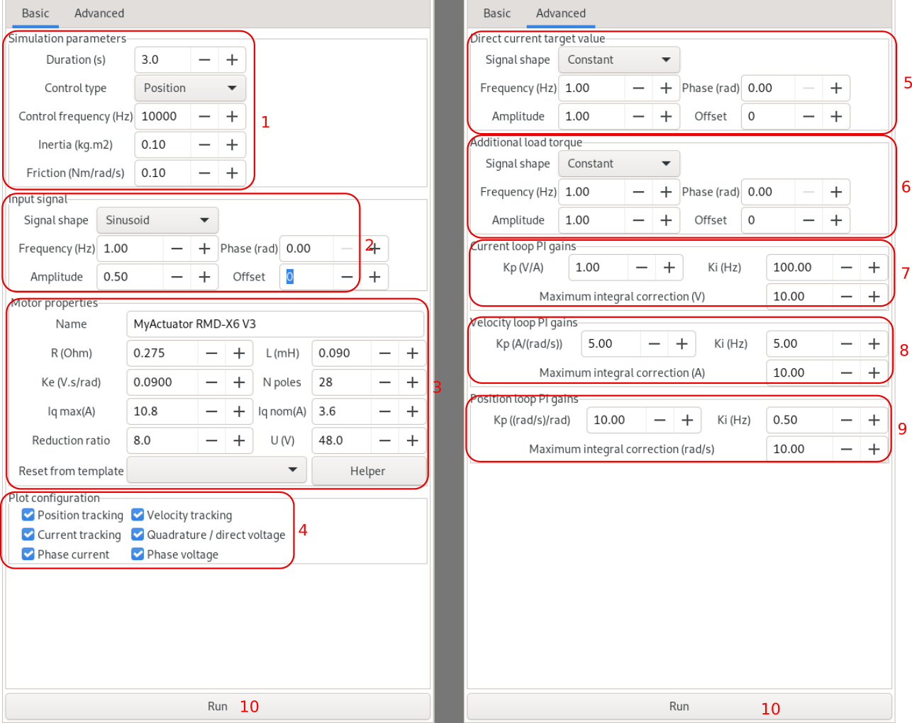

\tableofcontents

# Introduction

**Nemo** is a tool to compare motors and actuators.
The notion of motor and actuator is actually merged into one: for the software, a 'motor' is a real
motor, plus a reduction ratio (only simple transmissions are supported).

Nemo is made of several independant tabs, each with a configuration sidebar and a plot. Each tab is described below.

*General remark*: Because Matplotlib is quite slow, the plot is only updated on demand: whenever the user does a modification,
 a 'Update plot' button appears: this allows the user to do several modifications before asking for a plot update.

# Defining a motor

A motor (actuator) is parametrized in Nemo by 8 parameters:

 - $R$, the per-phase resistor
 - $L$, the per-phase inductance
 - $k_e$, the (single phase) BEMF constant
 - $n$, the number of poles
 - $I_{max}$, the maximum quadrature current
 - $I_{nominal}$, the nominal quadrature current
 - $\rho$, the reduction ratio
 - $U$, the input voltage

Additionally, a motor also has a name, used to create a legend.


These parameters can be set manually through the GUI, in the motor configuration widget shown below.\


To help you enter these values correctly, clicking on the "Helper" button will bring a dialog which will compute the
corresponding per-phase value from datasheet information (e.g. line to line values, delta motors, magnet characterized in
terms of $k_v$, $k_t$ or $k_e$...)


Additionally, a 'motor library' provides pre-configured motors for faster, error-free loading. These motor are then available
from a drop-down menu in the motor creation widget.

## Adding a motor to the library

The motor library is simply a json file describing each motor: the format is given below. A custom json file can be
loaded using the "motor library file" button at the top.
```
    "MyActuator RMD-X6 V3":
    {
        "R": 0.275,
        "L": 0.090,
        "ke": 0.0900,
        "i_quadrature_max": 10.8,
        "i_quadrature_nominal": 3.6,
        "np": 28,
        "U": 48,
        "reduction_ratio": 8
    },
```

\pagebreak

# The main window

The top of the main window gives access to several functions:


 - 1: *library loading button*: use this to replace the default library by another library json file
 - 2: *external plot switch*: The main objective of Nemo is to plot graphs. But because part of the screen is taken the GUI, the plot is not that big.
 To overcome this issue, the plot can be done in its own floating window, by activating this switch. When the 'external plot' switch is on, the plot is done on
 another window, which can be maximized / move to another screen. To return to the single window mode, you can either deactivate the
 switch, or minimize the external window (*note that the external window cannot be closed, only minimized*)

 - 3: *help* A drop-down menu, with a link to this user manual, and the mathematical documentation explaining the underlying model and computations.

\pagebreak

# The 'Compare' Tab

**Objective**: to compare the theoretical caracteristics of several motors


**GUI**

 - 1: *motor list* this lists the motors being compared. Elements in the list can be selected ; the selected element can be removed by the 'Remove' button, while the 'Add' button
 adds a new motor to the list.
 - 2: *motor properties*: this indicates the properties of the selected motor, which can thus be editted and modified.
 - 3: *derived constants*: this passive list shows a set of constants derived from the motor parameters. See the mathematical documentation for an explaination of each
 constant.

**Plot**: each motor is plotted in the specified color:

 - the full line plot is the caracteristic, at the specified max torque & battery voltage
 - the dotted line indicates the nominal current (thus nominal torque) limit
 - the lighter-colored curve is the defluxing limit of the motor.

\pagebreak

# The 'Single motor analysis' Tab

**Objective**: study more in details the behavior of a single motor - including efficiency thermal variation, battery power draw...


**GUI**

 - 1: *motor properties*: the properties of the plotted motor, at the nominal temperature
 - 2: *plot type*: the type of information being plotted in the color plot:
    - the mechanical power
    - the thermal power
    - the total (mecanical + thermal) power
    - the efficiency (mecanical / total power)
    - the battery state (drawn battery current, predicted battery voltage, obtained by modeling the battery as a constant voltage source + serie resistor)
 - 3: when plotting the battery state, the battery's internal resistance
 - 4: *temperature information*: coefficient of the simple linear thermal model applied:
 	- the stator's resistance increases linearily with temperature, with a given coefficient (0.4%/°C is the nominal value for copper)
	- the rotor's magnetic flux decreases linearily with temperature, with a given coefficient (-0.12%/°C is a typical value for Nd magnet)
 - 5: *derived constants*: several derived constants, with their variation between nominal and heated value.

**Plot**

 - In black, the caracteristic of the motor at nominal temperature
 - In green, the heated motor caracteristic
 - The color map depends on the plot type

*Example*: in this picture, the rotor and stator are both heated by 25°C from their nominal temperature. As a result, the torque decreases (due to a lower $k_e$). The increase
in $R$ reduces the max velocity at max torque, while the reduction of $k_e$ decreases the back EMF, hence a larger no-load speed.

\pagebreak

# The 'Simulation' Tab

**Objective**: simulate motor motion using a FOC controller. More specifically:

 - the motor driver follows the classical cascade control loop structure: a position PI feeds a velocity PI which feeds a current PI. This outputs direct and quadrature voltage targets, which are then executed using space vector modulation PWM.
  - the mechanical equation reads $I \ddot{\theta} = - \nu \dot{\theta} + \tau_m - \tau_l$, with $I$ the inertia, $\nu$ the viscous friction coefficient, $\tau_m$ the torque produced by the motor, and $\tau_l$ an extra resistive torque (load torque).


**GUI**

The configuration of the simulation has many parameters, and thus is done in two separate tabs shown here side by side:\


 - Basic:
    - 1: Simulation global parameters
        - Simulation duration
        - The type of control: position, velocity or current (i.e. torque)
        - Control loop frequency
        - The system's mechanical inertia
        - The system's viscous friction
    - 2: Configuration of the input signal. This signal is either a position, velocity or current reference, depending on the type of simulation selected.
    - 3: The motor being simulated. Note that the whole simulation is done at the articular level, i.e. the position and velocity plotted, or the feedback gains, refer to the output position (after the reduction ratio).
    - 4: Configuration of the plot - select the plots that you want to appear.
 - Advanced
    - 5: Direct current target: this is an exogenous signal, which can be used e.g. for defluxing
    - 6: Load torque (exogenous signal)
    - 7: Current loop PI gains and anti-windup limit value.
    - 8: Velocity loop PI gains and anti-windup limit value.
    - 9: Position loop PI gains and anti-windup limit value.
 - 10: Button to launch the simulation

